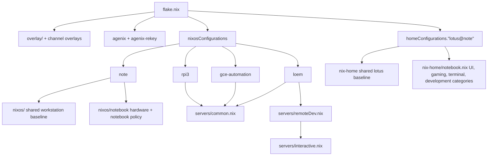

# ZShutils

ZShutils is a personal Nix flake for building and maintaining a small fleet of NixOS machines plus the shared Home Manager environment for the `lotus` user. The repository is organized around reusable system and user modules: machine definitions select the appropriate shared baseline, then add hardware, hosting, or workstation-specific configuration.

The README intentionally documents composition and operating model rather than the full set of packages installed by each host. Treat the Nix modules as the source of truth for exact software and service details.

## Architecture overview

The flake composes configurations in layers:

Important composition rules:

- `flake.nix` imports nixpkgs through `pkgsFun`, applying repository overlays from `overlay/`.
- `channelOverlays` expose alternate package channels as `pkgs.master` and `pkgs.stable` while preserving the active package set as `unstable` inside those channel imports.
- Every NixOS system gets the agenix and agenix-rekey modules before its machine modules.
- Native x86_64 builds use the normal `system` and shared `pkgs`; cross builds set host/build platforms and reuse the same overlay policy.
- The workstation path and server path are separate: `nixos/` is the shared workstation/system baseline, while `servers/common.nix` is the shared server baseline.

## Repository layout

- `flake.nix` — declares inputs, overlays, flake outputs, machine composition, Home Manager composition, checks, formatter, dev shell, and flake apps.
- `overlay/` — repository overlays and channel-specific overlay extensions used by `pkgsFun`.
- `nixos/` — shared workstation/system modules, reusable NixOS modules, SSH host data, Nix settings, registries, and user declarations.
- `nixos/notebook/` — `note`-specific hardware, boot, GPU, networking, and notebook policy.
- `servers/common.nix` — shared server baseline for locale, SSH defaults, Nix settings, registries, and operational tooling categories.
- `servers/interactive.nix` — server layer for SSH access, the `lotus` user, and Home Manager integration.
- `servers/remoteDev.nix` — extension for interactive servers that adds development-oriented Home Manager modules for `lotus`.
- `servers/loem/`, `servers/gce-automation/`, `servers/rpi3/` — host-specific server configurations.
- `nix-home/` — shared Home Manager baseline for `lotus`, plus category modules for notebook and interactive-server use.
- `secrets.nix`, `agenix-rekey.nix`, `secrets/` — age/agenix secret recipient policy, rekey integration, and encrypted secret material.
- `tests/` — module-level Nix checks for reusable modules.
- `commands.nix` — flake apps for local workflows such as build, diff, update, and formatting helpers.
- `templates/` — flake templates exported by this repository.

## Flake outputs

The main exported outputs are:

- `nixosConfigurations.note` — x86_64-linux workstation/laptop configuration composed from `./nixos` and `./nixos/notebook`.
- `nixosConfigurations.gce-automation` — x86_64-linux Google Compute image configuration composed from the upstream Google Compute image module and `./servers/gce-automation`.
- `nixosConfigurations.loem` — x86_64-linux server configuration composed from the disko module and `./servers/loem`.
- `nixosConfigurations.rpi3` — aarch64-linux Raspberry Pi 3 SD image configuration composed from `./servers/rpi3`.
- `homeConfigurations."lotus@note"` — Home Manager configuration for the `lotus` user on `note`, composed from `./nix-home` and `./nix-home/notebook.nix`.
- `legacyPackages` — the repository package set for supported systems, including overlays and channel overlays.
- `checks` — Linux module checks for selected reusable NixOS modules.
- `formatter` — the repository Nix formatter.
- `apps` — command wrappers from `commands.nix` for build, diff, update, and maintenance workflows.

## Machines

### `note`

`note` is the x86_64-linux workstation/notebook. Its NixOS configuration layers the shared `nixos/` baseline with `nixos/notebook/` for hardware configuration, boot setup, notebook networking, GPU support, and notebook-specific system policy. It sets `networking.hostName = "note"`. SDDM defaults to the i3 X11 session; Plasma remains selectable as the fallback desktop.

The separate Home Manager output `homeConfigurations."lotus@note"` builds the user environment for `lotus` from the shared `nix-home/` baseline and `nix-home/notebook.nix`, which imports category modules for UI, gaming, terminal, and development concerns. Its desktop module is `nix-home/ui/xsession.nix`; the binding migration review is `common/docs/i3-keybinding-migration.md`.

### `loem`

`loem` is an x86_64-linux server. Its flake entry includes the disko NixOS module, then delegates host policy to `servers/loem/`. The host configuration imports the shared server baseline, the remote-development server layer, storage and boot policy, and service category modules under `servers/loem/`.

Because `servers/remoteDev.nix` imports `servers/interactive.nix`, `loem` gets SSH access for `lotus`, Home Manager integration for that user, and the shared development-oriented Home Manager layer. `loem` also authorizes root SSH keys for root-level administration.

`servers/loem/forgejo.nix` runs a local Forgejo instance backed by the host PostgreSQL service, with repositories and LFS data persisted under `/var/lib/forgejo`. Forgejo listens only on loopback: the existing Cloudflare Tunnel publishes HTTPS at `git.fryuni.dev`, while Tailscale Serve exposes only the built-in SSH service as `git.rudd-agama.ts.net:22` inside the Tailnet. The same module continues to run the independent Forgejo Actions runners registered with Codeberg and git.gay.

### `gce-automation`

`gce-automation` is an x86_64-linux Google Compute image. Its flake entry combines the upstream Google Compute image NixOS module with `servers/gce-automation/`. That host imports `servers/common.nix` and adds a persistent `/data` filesystem plus host-local automation assets.

### `rpi3`

`rpi3` is an aarch64-linux Raspberry Pi 3 SD image. Its configuration imports the NixOS aarch64 SD image module, Raspberry Pi 3 hardware support, the shared server baseline, and repository networking modules. It sets `networking.hostName = "rpi3"` and declares x86_64 build-platform defaults so the image can be cross-built from the notebook when needed.

## Users

`nixos/users.nix` declares the normal user `lotus` with UID 1000, zsh as the login shell, immutable user management, SSH authorized keys, and workstation/server administration and device-access groups. The shared workstation baseline imports this user module, and `servers/interactive.nix` reuses it on interactive servers.

`note` sets the password hash for `lotus` and disables root SSH login. Interactive servers restrict SSH to `lotus` and `nix-ssh` and disable password authentication. `loem` additionally authorizes SSH keys for the `root` account, while the common server baseline otherwise defaults root SSH to key-only access.

Home Manager configuration is centered on `lotus`: `nix-home/default.nix` sets `/home/lotus` as the home directory and provides the shared user baseline, while notebook and server layers add category-specific modules where appropriate.

## Secrets

Secrets are managed with age through agenix and agenix-rekey:

- `secrets.nix` defines the recipient public keys and discovers encrypted files under `secrets/`.
- `agenix-rekey.nix` and the flake-level `agenix-rekey` configuration wire rekeying into NixOS configurations that expose `config.age`.
- NixOS systems receive the agenix and agenix-rekey modules before host-specific modules.
- Home Manager modules may also consume agenix secrets where imported, such as the `lotus@note` configuration.

The `secrets/` tree contains encrypted material and host-key data. Do not treat file names there as an application inventory; the active consumers are the NixOS and Home Manager modules that reference individual secrets.

## Workflows and validation

Common local workflows are exposed as flake apps from `commands.nix`:

- Home Manager build and diff helpers for `lotus@note`.
- NixOS build and diff helpers for `note`.
- Flake lock update and repository formatting helpers.

For validation, prefer the narrow output that matches the change:

- Evaluate or build the affected `homeConfigurations` output for Home Manager-only changes.
- Evaluate or build the affected `nixosConfigurations.<machine>` output for host changes.
- Run the relevant `checks` entry when changing a reusable module covered by `tests/`.
- Use the diff helpers to inspect prospective system or Home Manager changes before applying them.

Avoid turning this README into a package or service catalogue. When architecture changes, update the relevant section here so future readers can understand how the flake is composed before they inspect individual modules.
