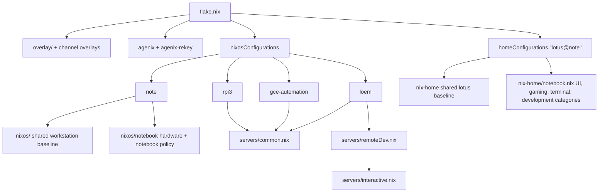

# ZShutils

ZShutils is a personal Nix flake for building and maintaining a small fleet of NixOS machines plus the shared Home Manager environment for the `lotus` user. The repository is organized around reusable system and user modules: machine definitions select the appropriate shared baseline, then add hardware, hosting, or workstation-specific configuration.

The README intentionally documents composition and operating model rather than the full set of packages installed by each host. Treat the Nix modules as the source of truth for exact software and service details.

## Architecture overview

The flake composes configurations in layers:

```mermaid
flowchart TD
    flake[flake.nix] --> overlays[overlay/ + channel overlays]
    flake --> secrets[agenix + agenix-rekey]
    flake --> nixosConfigs[nixosConfigurations]
    flake --> homeConfig["homeConfigurations.&quot;lotus@note&quot;"]

    nixosConfigs --> note[note]
    nixosConfigs --> loem[loem]
    nixosConfigs --> gce[gce-automation]
    nixosConfigs --> rpi3[rpi3]

    note --> workstation[nixos/ shared workstation baseline]
    note --> notebook[nixos/notebook hardware + notebook policy]
    homeConfig --> homeBase[nix-home shared lotus baseline]
    homeConfig --> homeNote[nix-home/notebook.nix UI, gaming, terminal, development categories]

    loem --> serverCommon[servers/common.nix]
    loem --> remoteDev[servers/remoteDev.nix]
    remoteDev --> interactive[servers/interactive.nix]
    gce --> serverCommon
    rpi3 --> serverCommon
```

Important composition rules:

- `flake.nix` imports nixpkgs through `pkgsFun`, applying repository overlays from `overlay/`.
- `channelOverlays` expose alternate package channels as `pkgs.master` and `pkgs.stable` while preserving the active package set as `unstable` inside those channel imports.
- `google-workspace-cli` follows the root `nixpkgs` input so its `gws` package uses the same upstream Cargo fetcher fixes as the main package set.
- Every NixOS system gets the agenix and agenix-rekey modules before its machine modules.
- Native x86_64 builds use the normal `system` and shared `pkgs`; cross builds set host/build platforms and reuse the same overlay policy.
- The workstation path and server path are separate: `nixos/` is the shared workstation/system baseline, while `servers/common.nix` is the shared server baseline.

## Repository layout

- `flake.nix` — declares inputs, overlays, flake outputs, machine composition, Home Manager composition, checks, formatter, dev shell, and flake apps.
- `overlay/` — repository overlays and channel-specific overlay extensions used by `pkgsFun`. `overlay/registry.nix` is the package registry: the authoritative seam for custom package exposure and update dispatch. Ordinary packages live one-per-file under `overlay/packages/` and are exposed by the registry-driven overlay; specialized families (`overlay/pulumi/`, `overlay/rustPackages/`) own their own exposure and updater scripts.
- `nixos/` — shared workstation/system modules, reusable NixOS modules, SSH host data, Nix settings, registries, and user declarations.
- `nixos/notebook/` — `note`-specific hardware, boot, GPU, networking, and notebook policy.
- `servers/common.nix` — shared server baseline for locale, SSH defaults, Nix settings, registries, and operational tooling categories.
- `servers/interactive.nix` — server layer for SSH access, the `lotus` user, and Home Manager integration.
- `servers/remoteDev.nix` — extension for interactive servers that adds development-oriented Home Manager modules for `lotus`.
- `servers/loem/`, `servers/gce-automation/`, `servers/rpi3/` — host-specific server configurations.
- `nix-home/` — shared Home Manager baseline for `lotus`, plus category modules for notebook and interactive-server use.
- `secrets.nix`, `agenix-rekey.nix`, `secrets/` — age/agenix secret recipient policy, rekey integration, and encrypted secret material.
- `tests/` — module-level Nix checks for reusable modules.
- `commands.nix` — flake apps for local workflows such as build, diff, update, and formatting helpers.
- `templates/` — flake templates exported by this repository.

## Flake outputs

The main exported outputs are:

- `nixosConfigurations.note` — x86_64-linux workstation/laptop configuration composed from `./nixos` and `./nixos/notebook`.
- `nixosConfigurations.gce-automation` — x86_64-linux Google Compute image configuration composed from the upstream Google Compute image module and `./servers/gce-automation`.
- `nixosConfigurations.loem` — x86_64-linux server configuration composed from the disko module and `./servers/loem`.
- `nixosConfigurations.rpi3` — aarch64-linux Raspberry Pi 3 SD image configuration composed from `./servers/rpi3`.
- `homeConfigurations."lotus@note"` — Home Manager configuration for the `lotus` user on `note`, composed from `./nix-home` and `./nix-home/notebook.nix`.
- `packages` — individual packages from `overlay/registry.nix`, selected from the final overlaid package set by registry name. Specialized families marked `isFamily = true` stay in `legacyPackages`.
- `legacyPackages` — the full nixpkgs package set for supported systems, including overlays, channel overlays, and specialized package families.
- `checks` — Linux module checks for selected reusable NixOS modules.
- `formatter` — the repository Nix formatter.
- `apps` — command wrappers from `commands.nix` for build, diff, update, and maintenance workflows.

## Machines

### `note`

`note` is the x86_64-linux workstation/notebook. Its NixOS configuration layers the shared `nixos/` baseline with `nixos/notebook/` for hardware configuration, boot setup, notebook networking, GPU support, and notebook-specific system policy. It sets `networking.hostName = "note"`. SDDM defaults to the i3 X11 session; Plasma remains selectable as the fallback desktop.

The separate Home Manager output `homeConfigurations."lotus@note"` builds the user environment for `lotus` from the shared `nix-home/` baseline and `nix-home/notebook.nix`, which imports category modules for UI, gaming, terminal, and development concerns. Its desktop module is `nix-home/ui/xsession.nix`; the binding migration review is `common/docs/i3-keybinding-migration.md`.

`nix-home/ui/terminal-environment.nix` connects every new Zsh shell to the active local desktop using the graphical environment held by the systemd user manager. This includes SSH login shells, noninteractive SSH commands, and new Herdr panes; their child processes inherit the display, X authentication path, user D-Bus address, runtime directory, and desktop type. The local desktop takes precedence over an SSH-forwarded display. Only these desktop variables are imported, and startup leaves the environment unchanged when no graphical session is active. This module is notebook-only; server shells are unaffected. After applying Home Manager, open a new shell; existing shells can refresh with `exec zsh`. Already-running processes retain their old environment, so restart a Herdr server started without desktop access when convenient. Each new shell reads the current authentication path again after a graphical re-login.

Polybar uses an XEmbed tray. The `snixembed` user service bridges modern StatusNotifierItem icons (including Slack and OpenWhispr) into it and acquires the D-Bus watcher before Vicinae starts. The package overlay patches snixembed's ARGB pixel stride so bitmap-only icons render correctly.

### `loem`

`loem` is an x86_64-linux server. Its flake entry includes the disko NixOS module, then delegates host policy to `servers/loem/`. The host configuration imports the shared server baseline, the remote-development server layer, storage and boot policy, and service category modules under `servers/loem/`.

Because `servers/remoteDev.nix` imports `servers/interactive.nix`, `loem` gets SSH access for `lotus`, Home Manager integration for that user, and the shared development-oriented Home Manager layer. `loem` also authorizes root SSH keys for root-level administration.

`servers/loem/forgejo.nix` runs a local Forgejo instance backed by the host PostgreSQL service, with repositories and LFS data persisted under `/var/lib/forgejo`. Forgejo listens only on loopback: the existing Cloudflare Tunnel publishes HTTPS at `git.fryuni.dev`, while Tailscale Serve exposes only the built-in SSH service as `git.rudd-agama.ts.net:22` inside the Tailnet. The same module continues to run the independent Forgejo Actions runners registered with the local Forgejo, Codeberg, and git.gay, configured through the first-party nixpkgs `services.forgejo-runner` module.

All three Actions runners expose `nix:host` for workflows using `runs-on: nix`. They share an explicit host package list that puts Nix and the workflow tools on each runner service's PATH; host jobs use the host Nix daemon and store.

`servers/loem/github-actions.nix` also runs GitHub Actions through `services.github-runners`. The compact scope-to-credential map in `servers/loem/github-actions-runners.nix` creates one registration per personal repository (`Fryuni/t3code` initially) and one per organization (`fryuni-testorg` initially). Each registration has its own service and disk-backed workspace, supports host Nix and Docker jobs, and accepts `runs-on: [self-hosted, nix, loem]`. Each adds capacity for one concurrent job. Credentials use agenix when the corresponding encrypted source exists, with root-only provisioned files as a bootstrap fallback. See [GitHub runner setup](servers/loem/github-actions.md) for credential provisioning, adding repositories, and validation.

The `pkgs.forgejo` overlay builds both the server and frontend from [Fryuni's fork](https://git.fryuni.dev/Fryuni/forgejo), pinned to a commit on its `forgejo` branch. Service configuration and persistent data paths are unchanged.

`servers/loem/executor.nix` runs the [self-hosted Executor](https://executor.sh/docs/hosted/docker) MCP server as a Docker container through `virtualisation.oci-containers`, using the Docker backend already configured by `nixos/modules/docker.nix`. The image is pinned by multi-arch index digest rather than tracking `:latest`, because `oci-containers` only pulls when the reference is absent locally. A single container process serves the typed API, the streamable-HTTP MCP endpoint, authentication, QuickJS code execution, and the web console, backed by a libSQL file; no external database or worker is involved. Its published port is bound to `127.0.0.1:4788` because Docker publishes ports past the NixOS firewall, so the tailnet Caddy proxy is the only reachable entrypoint, exposing the `executor` alias at `https://executor.loem.lferraz.dev`. State lives in a root-owned bind mount at `/var/lib/executor`, holding `data.db` plus the session secret and the master key for stored secrets that the container generates on first boot; `EXECUTOR_WEB_BASE_URL` matches the proxied URL so browser logins are not rejected as invalid-origin, and `EXECUTOR_ALLOW_LOCAL_NETWORK` stays disabled to keep sandboxed code away from the Tailnet and this host's loopback services.

`servers/loem/metrics/` runs VictoriaMetrics on loopback with one month of retention, publishes it inside the Tailnet as `victoriametrics.rudd-agama.ts.net` through Tailscale Serve, and runs Grafana on loopback with provisioned datasources and dashboards. The VictoriaMetrics datasource pins `uid = "victoriametrics"` so provisioned dashboards can reference it without depending on a generated identifier. `servers/loem/metrics/dashboards/nix-store-cache.json` charts the remote cache upload queue for the whole fleet: pending entries and the oldest pending entry, paths sent to the cache over the last 24 hours and in total, a per-host breakdown, and failed or expired entries. It is filterable by host and reads the metrics described under the shared remote Nix cache.

### `gce-automation`

`gce-automation` is an x86_64-linux Google Compute image. Its flake entry combines the upstream Google Compute image NixOS module with `servers/gce-automation/`. That host imports `servers/common.nix` and adds a persistent `/data` filesystem plus host-local automation assets.

### `rpi3`

`rpi3` is an aarch64-linux Raspberry Pi 3 SD image. Its configuration imports the NixOS aarch64 SD image module, Raspberry Pi 3 hardware support, the shared server baseline, and repository networking modules. It sets `networking.hostName = "rpi3"` and declares x86_64 build-platform defaults so the image can be cross-built from the notebook when needed.

## Users

`nixos/users.nix` declares the normal user `lotus` with UID 1000, zsh as the login shell, immutable user management, SSH authorized keys, and workstation/server administration and device-access groups. The shared workstation baseline imports this user module, and `servers/interactive.nix` reuses it on interactive servers.

`note` sets the password hash for `lotus` and disables root SSH login. Interactive servers restrict SSH to `lotus` and disable password authentication. `loem` additionally authorizes SSH keys for the `root` account, while the common server baseline otherwise defaults root SSH to key-only access.

Home Manager configuration is centered on `lotus`: `nix-home/default.nix` sets `/home/lotus` as the home directory and provides the shared user baseline, while notebook and server layers add category-specific modules where appropriate.

### T3 Code

`note` and `loem` import `nixos/modules/t3code.nix`. It runs `llm-agents.t3code`'s `t3 serve` as `lotus`, restarting on exit. On hosts with X enabled (`note`), it is a systemd user service attached to `graphical-session.target`: it starts with the desktop, inherits its display and authentication environment, and stops at graphical logout. T3 and its tools therefore have local desktop access even when the client connects remotely. A new graphical login starts it with fresh credentials. On headless hosts (`loem`), it remains a boot-enabled system service without requiring a login session. Both forms use `/home/lotus` for their working directory and home, retaining T3's default per-user state and provider credentials; PATH includes the user's Nix profiles and system tools.

The backend binds only to `127.0.0.1:3773`. The existing tailnet DNS, certificates, and Caddy proxy expose the `t3` alias at `https://t3.note.lferraz.dev` and `https://t3.loem.lferraz.dev`; no public backend port or separate Tailscale Serve configuration is added. T3's own pairing/authentication remains enabled. Inspect startup and pairing details with `journalctl --user -u t3code.service` on `note`, or `journalctl -u t3code.service` on `loem`. Applying the NixOS change removes the old system service on `note`; the user service starts on the next graphical login, or with `systemctl --user start t3code.service` from the active desktop after applying.

### Claude Code

The shared terminal AI module installs `llm-agents.claude-code` with a wrapper that routes requests to `https://llm.loem.lferraz.dev`, including when launched by T3. The base URL omits `/v1` because the Anthropic client adds it. Loem currently requires no client API key; the wrapper supplies a non-secret placeholder auth token to satisfy Claude Code's client-side authentication check and clears `ANTHROPIC_API_KEY`. Nonessential Claude Code traffic is disabled. The wrapper leaves Claude's user settings and session files writable.

### Herdr

The shared terminal AI module imports `nix-home/terminal/herdr/` on notebook and interactive-server Home Manager configurations. It owns Herdr's `config.toml` and `plugins.json`; session files, logs, and plugin state remain writable and unmanaged. Change settings and the installed plugin set in the flake rather than through Herdr's settings or plugin-management commands.

`nix-home/terminal/herdr/plugins/` defines store-backed plugin packages. The current Treehouse integration comes from the locked `herdr-treehouse` flake input; its upstream flake provides only development shells, so the local package definition installs its manifest and scripts with store paths for Python, Git, Gum, and Treehouse. Add repository-local custom plugins in this directory; Git-backed plugins should use pinned flake inputs (`flake = false` for repositories without a flake).

For the first activation on a machine with a manual setup, back up `~/.config/herdr/config.toml` and `~/.config/herdr/plugins.json` before replacing them with Home Manager's links, or use Home Manager's backup option. Existing files are not force-overwritten. The adopted configuration currently enables only `local.herdr-treehouse`; historical plugin state is not an installation source. Reload or restart Herdr after applying the generation.

## Secrets

Secrets are managed with age through agenix and agenix-rekey:

- `secrets.nix` defines the recipient public keys and discovers encrypted files under `secrets/`.
- `agenix-rekey.nix` and the flake-level `agenix-rekey` configuration wire rekeying into NixOS configurations that expose `config.age`.
- NixOS systems receive the agenix and agenix-rekey modules before host-specific modules.
- Home Manager modules may also consume agenix secrets where imported, such as the `lotus@note` configuration.

The `secrets/` tree contains encrypted material and host-key data. Do not treat file names there as an application inventory; the active consumers are the NixOS and Home Manager modules that reference individual secrets.

### Shared remote Nix cache

`nixos/nix-settings.nix` enables `nixos/modules/nix-store-cache.nix` on all four NixOS machines, through the workstation baseline or `servers/common.nix`. It replaces the SSH peer cache; host SSH keys remain in use for normal SSH and agenix. The remote server is [Cubby](https://git.fryuni.dev/Fryuni/cloudflare-nix-cache).

The shared `services.nixStoreCache` settings expose `endpoint`, `tokenFile`, `uploadConcurrency` (a positive integer, default `1`), and `maxQueueAgeSeconds` (a positive integer, default `604800`, or seven days). Nix and Cachix connect directly to `https://nix-cache.fryuni.dev` for substitution and uploads; there is no local proxy. Agenix decrypts `secrets/nix-store-cache-token` to a root-owned, mode `0600` runtime file containing only the write token. On every machine, the daemon startup hook generates `/run/nix-store-cache/netrc` (mode `0600`, directory `0700`) from that token and the endpoint hostname; `nix.settings.netrc-file` points to this generated file. Credentials never enter the Nix store. HTTPS is required except for localhost testing. Netrc credentials are hostname-scoped, not path-scoped, so use a dedicated cache hostname.

Determinate Nix overrides `netrc-file` after including NixOS settings. On those machines, the daemon startup hook also appends any existing `/nix/var/determinate/netrc` to the generated netrc. The daemon receives that path through `NIX_CONFIG`. This intentionally avoids `authentication.additionalNetrcSources`, whose merged file is world-readable. The private copy is refreshed on daemon restart, including after changes to Determinate credentials. Upstream Nix machines use the generated netrc through `nix.settings.netrc-file`. The independent upload service explicitly uses the agenix file on all machines; it does not depend on the daemon's private runtime file.

The generated netrc contains `machine nix-cache.fryuni.dev`, `login ""`, and `password "<Cubby WRITE_TOKEN>"`. The empty login preserves Cubby's Basic authentication convention. Normal users can request substitution through the daemon without reading the credential. Direct user `nix copy` commands need their own credentials; remote uploads are not delegated to the daemon. The configured Cubby public key verifies cache signatures; global signature verification remains enabled and the substituter is not marked `trusted=true`. Treat remote write access and the cache signing key as authority to supply executable store paths to every machine.

The system post-build hook only enqueues locally built outputs as direct GC-root symlinks in the root-only `/nix/var/nix/gcroots/nix-store-cache` directory; it performs no network operations. Duplicate outputs coalesce without refreshing their queue age. `nix-store-cache-upload.service` drains this persistent queue with at most `uploadConcurrency` concurrent `cachix --host https://nix-cache.fryuni.dev push main` processes. Cachix uses multipart uploads to split large NARs into smaller requests rather than exceeding the hosting platform's single-request limit. At startup, the service reads the agenix token file directly and exports it as `CACHIX_AUTH_TOKEN`; the token is never embedded in a store path or command-line argument. Uploads include reference closures so dependencies need not finish separate uploads first. The root service reads the local store directly, independently of the build daemon. Successful uploads remove their queue entries; failures log a warning and retain entries for retry. Each drain pass is followed by a five-second pause, and systemd restarts an interrupted worker. Pending entries survive service restarts and reboots and keep their closures alive through garbage collection until uploaded or expired. Inspect failures with `journalctl -u nix-store-cache-upload.service`. Substituted paths do not run the hook; existing store paths are not automatically backfilled. Other configured substituters remain available during a cache outage.

`nix-store-cache-expire.timer` runs an independent hourly cleanup, including catch-up after downtime. Entries at least `maxQueueAgeSeconds` old are removed based on the symlink modification time, unaffected by upload retries or GC reads. Expiration can lag the age limit by roughly one timer interval while the host is running. Cleanup removes only queue roots, never store paths; subsequent normal GC (including `nh clean all -K 8h`) can reclaim paths not protected by other roots. The `8h` generation-retention setting does not itself expire these queue roots. Expired outputs are no longer guaranteed to reach the cache. Cleanup continues if the uploader is stopped or stalled, but disabling the entire cache module also removes its expiration timer: clear any remaining queue symlinks when decommissioning the module.

`services.nixStoreCache.metrics` publishes queue telemetry through the Prometheus node exporter's textfile collector. It defaults to following `services.prometheus.exporters.node.enable`, so `note`, `loem`, and `rpi3` collect metrics while `gce-automation`, which runs no exporter and has no Tailnet identity, does not. `nix-store-cache-metrics.timer` fires every `metrics.interval` (default `30s`, with `AccuracySec=1s` so systemd does not coalesce it past the 15s scrape interval) and publishes `nix-store-cache.prom` into `metrics.textfileDirectory` (default `/var/lib/prometheus-node-exporter/textfile`) by atomic rename. That directory is world-readable because the node exporter runs unprivileged; the queue itself stays root-only. The exporter is scraped by the host `vmagent`, which remote-writes to `loem`. Because `nixos/modules/networking/tailscale.nix` stamps `instance` and `host` with the hostname through `global.relabel_configs`, series from different machines stay distinct.

Five series are published. `nix_store_cache_queue_pending` and `nix_store_cache_queue_oldest_seconds` are gauges derived from the queue directory on each collection. `nix_store_cache_uploads_total`, `nix_store_cache_upload_failures_total`, and `nix_store_cache_expired_total` are counters persisted under `/var/lib/nix-store-cache`. The upload and expiry scripts increment them under `flock` and publish each value by rename, so concurrent upload workers cannot lose an increment and the collector cannot observe a partial value. Counter updates are best effort: a telemetry failure never fails an upload or a sweep. Counters survive reboots and reset only when that state directory is cleared, which appears as an ordinary counter reset to `rate` and `increase`.

Credential maintenance and deployment:

1. Configure the endpoint in `nixos/nix-settings.nix`; its hostname is used automatically in the generated netrc.
2. Use `agenix -e secrets/nix-store-cache-token` with an authorized master identity to edit the raw write token, optionally followed by a newline. Do not add netrc fields or quotes; the runtime generator handles netrc escaping.
3. Run `just rekey` and stage the updated encrypted source and host-specific rekeyed files.
4. For `gce-automation`, first assign a stable hostname and register its SSH host public key with the existing host-key/rekey workflow. That image currently has no host identity and uses agenix-rekey's dummy recipient; its secrets cannot decrypt until provisioned.
5. Build the affected NixOS configuration before applying it. Deploy the updated secret after rotation and restart both `nix-daemon.service` and `nix-store-cache-upload.service` to ensure all transfers use the new credentials.

The netrc migration was checked with remote cache metadata access and a local HTTP cache requiring Basic authentication for Nix uploads and downloads into an isolated store. A separate isolated configuration-precedence smoke test reproduced HTTP 401 with Determinate's override and verified an authenticated response using the generated private netrc and daemon environment. The local unsigned fixture alone used `--no-check-sigs`; production signature settings are unchanged. These checks did not activate a configuration.

## Workflows and validation

Common local workflows are exposed as flake apps from `commands.nix`:

- Home Manager build and diff helpers for `lotus@note`.
- NixOS build and diff helpers for `note`.
- Flake lock update and repository formatting helpers.

### Package updates

All custom overlay package updates derive from `overlay/registry.nix`; there is no hand-maintained package list anywhere else:

- `just update-overlays` dispatches every registry entry that declares an update strategy, in deterministic name order, aborting on the first failure.
- `just update-package <name>` (or `overlay/update.sh <name>`) dispatches a single entry for targeted maintenance or diagnosis.
- Registry entries pick one of three strategies: ordinary `nix-update` against `packages.x86_64-linux` using short package names (full argument flexibility), a specialized family updater (`overlay/pulumi/update.sh`, `overlay/rustPackages/update.mjs`), or no automatic updater for intentionally pinned packages (for example the terminal `terraformOSS` pin). Short names also become the update commit subjects, without rewriting commits.
- Adding an ordinary package means dropping `<name>.nix` into `overlay/packages/` and adding one registry entry; exposure and update dispatch follow automatically.
- `just update-package forgejo` fetches the latest commit on the fork's `forgejo` branch, then refreshes the source, Go vendor, and npm dependency hashes. It does not select release tags. Run `overlay/packages/update-forgejo.sh --no-commit` to update the pin without committing.
- `just update-package vite-plus` selects the latest stable GitHub release, refreshes all supported binary hashes and the npm lockfile/dependency hash, and builds the candidate before replacing the package files and committing them as `vite-plus: {old} -> {new}`. Unchanged releases are skipped. It also runs through `just update`; use `overlay/packages/update-vite-plus.py --no-commit` to review an update without staging or committing it.

Forgejo Actions automate the same maintenance paths on the self-hosted Nix runner:

- Every pull request builds all NixOS targets, the `lotus@note` Home Manager generation, and the reusable-module checks.
- A weekly and manually dispatched update workflow runs `just update` from `main`. Serialized runs force-push the existing update PR branch, or create `automation/update-dependencies` and a PR when needed. It reuses branches from the previous per-run naming scheme, closes duplicate update PRs, and closes stale update PRs when there are no changes.
- Update PRs are then scheduled for a rebase-then-fast-forward auto-merge (the `rebase` style) that lands once every check succeeds, deleting the branch afterwards. That style creates no commit of its own, so no merge title or body is sent. The workflow first waits for the pushed head to leave the conflict-checking state and for its commit statuses to appear, because the Forgejo fork treats a commit with no workflow runs as ready to merge; scheduling earlier could merge before CI starts. An already-scheduled PR is not an error, and the workflow fails rather than leaving a PR unscheduled.
- Publication uses a short-lived OIDC JWT for Git and API authentication, following the [Authorized Application example](https://git.fryuni.dev/Fryuni/llm-agents.nix/src/branch/main/.forgejo/workflows/update.yml). The repository Actions variable `TOKEN_AUDIENCE` identifies the application audience. The application must allow this repository, `.forgejo/workflows/update.yml`, `refs/heads/main`, and the `schedule` and `workflow_dispatch` events, with repository and pull-request write access. Checkout persists no credentials, and the publication JWT is minted after the updaters finish; `UPDATE_FORGEJO_TOKEN` is no longer used. The update step receives the `GITHUB_TOKEN` Actions secret for authenticated GitHub API requests to reduce rate limiting.

For validation, prefer the narrow output that matches the change:

- Evaluate or build the affected `homeConfigurations` output for Home Manager-only changes.
- Evaluate or build the affected `nixosConfigurations.<machine>` output for host changes.
- Run the relevant `checks` entry when changing a reusable module covered by `tests/`.
- Use the diff helpers to inspect prospective system or Home Manager changes before applying them.

Avoid turning this README into a package or service catalogue. When architecture changes, update the relevant section here so future readers can understand how the flake is composed before they inspect individual modules.
