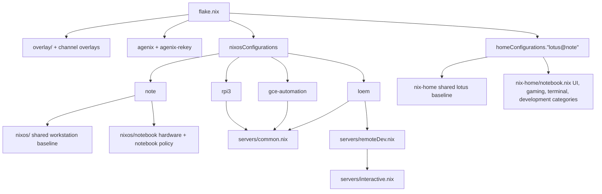

# Architecture

[Project overview](../README.md)

The flake composes shared package, system, and user layers. Machine modules choose those
layers and add hardware or host-specific policy. Exact package and service settings live
in the Nix modules.

## Configuration layers

The flake composes configurations in layers:

Important composition rules:

- `flake.nix` imports nixpkgs through `pkgsFun`, applying repository overlays from
  `overlay/`.
- `channelOverlays` expose alternate package channels as `pkgs.master` and `pkgs.stable`
  while preserving the active package set as `unstable` inside those channel imports.
- Every NixOS system gets the agenix, agenix-rekey, and disabled-by-default machine
  backup modules before its machine modules. Services can declare their backup
  state on every machine without enrolling it in scheduled backups.
- Native x86_64 builds use the normal `system` and shared `pkgs`; cross builds set
  host/build platforms and reuse the same overlay policy.
- `note` and `loem` enable `nixos/modules/machine-backups.nix`, which packages the
  capture and restic runner in `common/backups/`, declares root-only agenix backup
  credentials, and schedules system jobs. Each service's defining module registers
  its state directories, exclusions, and consistency protocol through
  `services.machineBackups.directories` or a named native capture. Home Manager
  uses the same registration options; NixOS aggregates the selected user's
  declarations and supplies their systemd username and UID. Embedded Home Manager
  is selected automatically; `note` explicitly selects its standalone Home Manager
  output through `services.machineBackups.homeManager`. Native database
  captures merge dependent application registrations by capture name. The engine
  contains no service catalogue or service enable checks. `loem` owns
  shared repository maintenance. Restic reads selected files directly; staging
  holds native database exports and recovery artifacts. Application writers pause
  through upload, with a configurable one-hour limit; transient systemd watchdogs
  resume them if the backup exits or reaches its interruption deadline.
- The workstation path and server path are separate: `nixos/` is the shared
  workstation/system baseline, while `servers/common.nix` is the shared server baseline.

## Repository layout

- `flake.nix` — declares inputs, overlays, flake outputs, machine composition, Home
  Manager composition, checks, formatter, dev shell, and flake apps.
- `overlay/` — repository overlays and channel-specific overlay extensions used by
  `pkgsFun`. `overlay/registry.nix` is the package registry: the authoritative seam for
  custom package exposure and update dispatch. Ordinary packages live one-per-file under
  `overlay/packages/` and are exposed by the registry-driven overlay; specialized
  families (`overlay/pulumi/`, `overlay/rustPackages/`) own their own exposure and
  updater scripts.
- `nixos/` — shared workstation/system modules, reusable NixOS modules, SSH host data,
  Nix settings, registries, and user declarations.
- `nixos/notebook/` — `note`-specific hardware, boot, GPU, networking, and notebook
  policy.
- `servers/common.nix` — shared server baseline for locale, SSH defaults, Nix settings,
  registries, and operational tooling categories.
- `servers/interactive.nix` — server layer for SSH access, the `lotus` user, and Home
  Manager integration.
- `servers/remoteDev.nix` — extension for interactive servers that adds
  development-oriented Home Manager modules for `lotus`.
- `servers/loem/`, `servers/gce-automation/`, `servers/rpi3/` — host-specific server
  configurations.
- `nix-home/` — shared Home Manager baseline for `lotus`, plus category modules for
  notebook and interactive-server use.
- `secrets.nix`, `agenix-rekey.nix`, `secrets/` — age/agenix secret recipient policy,
  rekey integration, and encrypted secret material.
- `tests/` — module-level Nix checks, isolated backup/database recovery fixtures,
  and offline package-updater regression tests.
- `commands.nix` — flake apps for local workflows such as build, diff, update, and
  formatting helpers.
- `templates/` — flake templates exported by this repository.

## Flake outputs

The main exported outputs are:

- `nixosConfigurations.note` — x86_64-linux workstation/laptop configuration composed
  from `./nixos` and `./nixos/notebook`.
- `nixosConfigurations.gce-automation` — x86_64-linux Google Compute image configuration
  composed from the upstream Google Compute image module and `./servers/gce-automation`.
- `nixosConfigurations.loem` — x86_64-linux server configuration composed from the disko
  module and `./servers/loem`.
- `nixosConfigurations.rpi3` — aarch64-linux Raspberry Pi 3 SD image configuration
  composed from `./servers/rpi3`.
- `homeConfigurations."lotus@note"` — Home Manager configuration for the `lotus` user on
  `note`, composed from `./nix-home` and `./nix-home/notebook.nix`.
- `packages` — individual packages from `overlay/registry.nix`, selected from the final
  overlaid package set by registry name. Specialized families marked `isFamily = true`
  stay in `legacyPackages`.
- `legacyPackages` — the full nixpkgs package set for supported systems, including
  overlays, channel overlays, and specialized package families.
- `checks` — Linux checks for selected reusable NixOS modules and the Vite+ updater.
- `formatter` — the repository Nix formatter.
- `apps` — command wrappers from `commands.nix` for build, diff, update, and maintenance
  workflows.
  `cache-push` manually queues installable outputs or existing store paths for the
  shared remote cache.

## Machines

### `note`

`note` is the x86_64-linux workstation/notebook. Its NixOS configuration layers the
shared `nixos/` baseline with `nixos/notebook/` for hardware configuration, boot setup,
notebook networking, GPU support, and notebook-specific system policy. It sets
`networking.hostName = "note"`.

The separate Home Manager output `homeConfigurations."lotus@note"` builds the user
environment for `lotus` from the shared `nix-home/` baseline and
`nix-home/notebook.nix`, which imports category modules for UI, gaming, terminal, and
development concerns.

Desktop behavior is described in [Notebook desktop](desktop.md).

### `loem`

`loem` is an x86_64-linux server. Its flake entry includes the disko NixOS module, then
delegates host policy to `servers/loem/`. The host configuration imports the shared
server baseline, the remote-development server layer, storage and boot policy, and
service category modules under `servers/loem/`.

Because `servers/remoteDev.nix` imports `servers/interactive.nix`, `loem` gets SSH
access for `lotus`, Home Manager integration for that user, and the shared
development-oriented Home Manager layer. `loem` also authorizes root SSH keys for
root-level administration.

See [Hosted services and Tailnet access](services.md) for service operation and runner
guides.

### `gce-automation`

`gce-automation` is an x86_64-linux Google Compute image. Its flake entry combines the
upstream Google Compute image NixOS module with `servers/gce-automation/`. That host
imports `servers/common.nix` and adds a persistent `/data` filesystem plus host-local
automation assets.

### `rpi3`

`rpi3` is an aarch64-linux Raspberry Pi 3 SD image. Its configuration imports the NixOS
aarch64 SD image module, Raspberry Pi 3 hardware support, the shared server baseline,
and repository networking modules. It sets `networking.hostName = "rpi3"` and declares
x86_64 build-platform defaults so the image can be cross-built from the notebook when
needed.

## Users and Home Manager

`nixos/users.nix` declares the normal user `lotus` with UID 1000, zsh as the login
shell, immutable user management, SSH authorized keys, and workstation/server
administration and device-access groups. The shared workstation baseline imports this
user module, and `servers/interactive.nix` reuses it on interactive servers.

`note` sets the password hash for `lotus` and disables root SSH login. Interactive
servers restrict SSH to `lotus` and disable password authentication. `loem` additionally
authorizes SSH keys for the `root` account, while the common server baseline otherwise
defaults root SSH to key-only access.

Home Manager configuration is centered on `lotus`: `nix-home/default.nix` sets
`/home/lotus` as the home directory and provides the shared user baseline, while
notebook and server layers add category-specific modules where appropriate.

## Related guides

- [Secrets and host identities](secrets.md) explains agenix and rekeying.
- [Maintenance and validation](maintenance.md) covers builds, checks, overlays, and
  updates.
